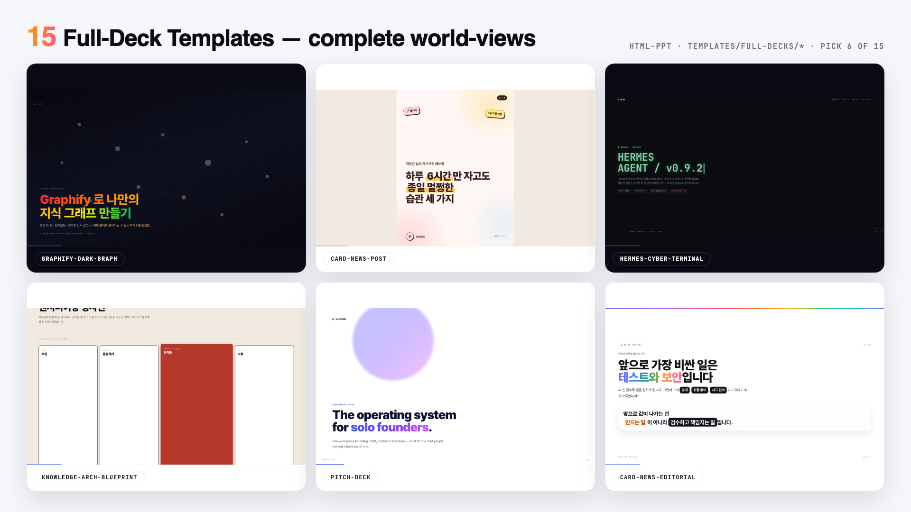
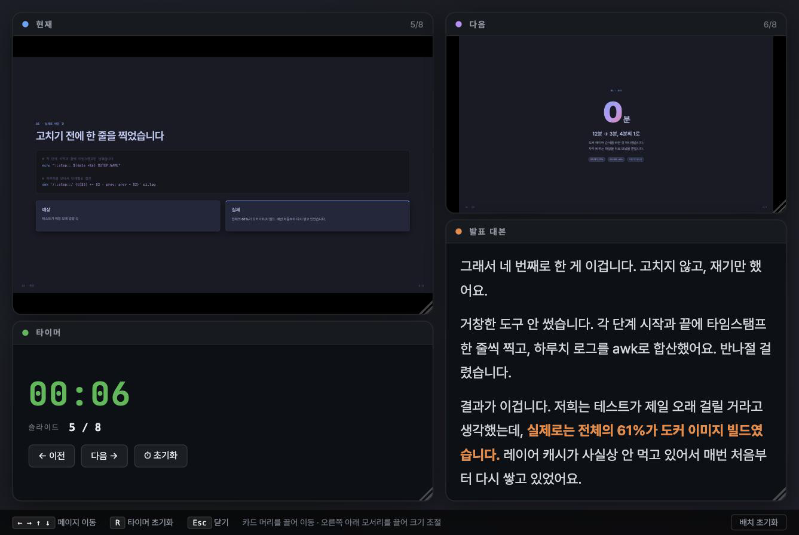
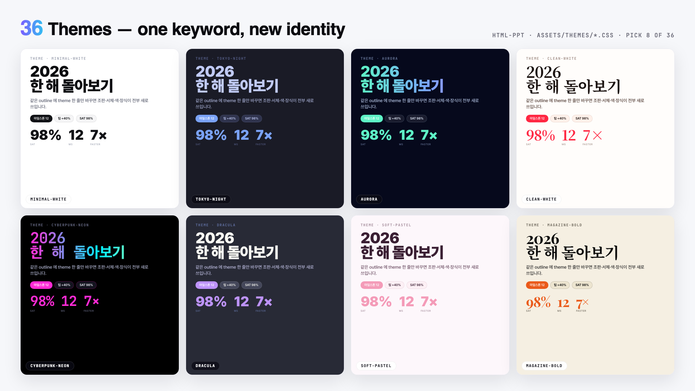
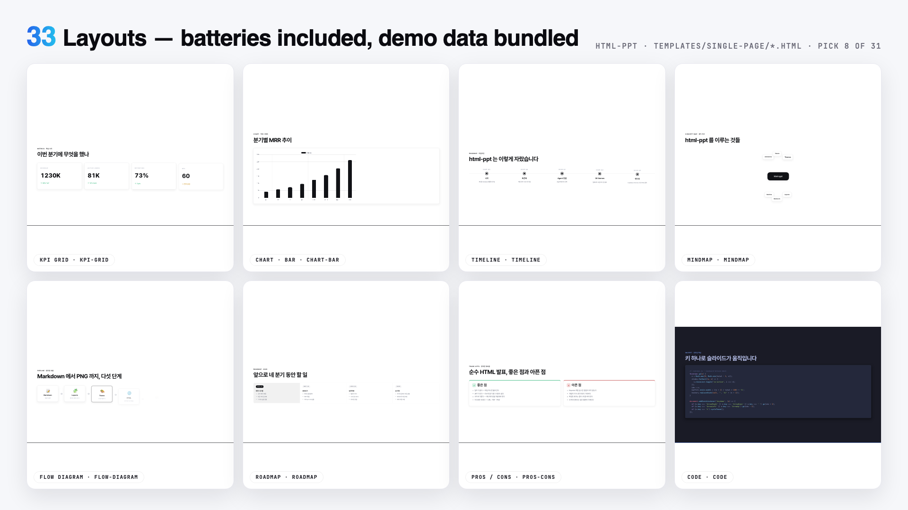
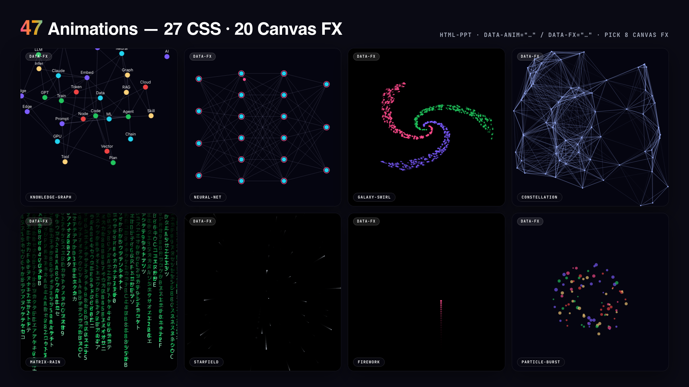

# html-ppt

Author professional presentations as plain HTML files. No build step, no
runtime dependency, no network. Press `S` and you get a real presenter window
with your script and a timer; press `T` and the whole deck changes clothes.

**36 themes · 15 full-deck templates · 33 page layouts · 47 animations ·
presenter mode · fully offline**



```bash
npx skills add https://github.com/jaebeompark/html-ppt-skill
```

---

## Why this one

**It works with the wifi off.** Every webfont is vendored into the repository
and declared as a local `@font-face` — nothing is fetched from a CDN at
presentation time. This matters more than it sounds: with a CDN import, a dead
network means Hangul silently falls back to a system face *mid-talk*. Line
breaks move, the headline rewraps, and you find out in front of the audience.

**Korean is the first-class language.** Pretendard covers Latin and Hangul in
one family, so a line like `12분 → 3분` keeps its letter-spacing and baseline.
The presenter window's own chrome follows the deck's `<html lang>` — Korean by
default, English with `lang="en"`. Serif themes fall through to Noto Serif KR.

**A deck is a file.** One `.html` you can diff, review, commit, and open with
a double-click in ten years.

---

## Quick start

```bash
./scripts/new-deck.sh my-talk      # scaffold from templates/deck.html
open examples/my-talk/index.html
```

Then, in order:

1. **Pick a theme.** Press `T` to cycle, or hard-code it:
   ```html
   <link rel="stylesheet" id="theme-link" href="../../assets/themes/aurora.css">
   ```
   Catalogue: [references/themes.md](references/themes.md)

2. **Pick layouts.** Open a file in `templates/single-page/`, copy its
   `<section class="slide">…</section>` block into your deck, replace the demo
   data. Layout CSS is already wired — `base.css` imports `assets/layouts.css`,
   which owns every class those blocks use, so copying the `<section>` is
   enough. Catalogue: [references/layouts.md](references/layouts.md)

3. **Write the speaker script.** One `<aside class="notes">` per slide.
   Guide: [references/presenter-mode.md](references/presenter-mode.md)

4. **Verify.** `./scripts/smoke.sh --render`

Or skip straight to a finished look by copying a whole deck out of
`templates/full-decks/`.

---

## 🎤 Presenter mode

Press `S` on any deck. A separate presenter window opens while the original
page stays as the audience view.



Four draggable, resizable cards:

| card | what it shows |
|---|---|
| 🔵 **현재** | pixel-perfect preview of the current slide |
| 🟣 **다음** | the next slide, same fidelity |
| 🟠 **발표 대본** | your script at 18px, scrollable, `<strong>`/`<em>` honoured |
| 🟢 **타이머** | elapsed time, slide counter, prev/next/reset |

The previews are not screenshots. Each is an `<iframe>` loading the same deck
file with `?preview=N`; `runtime.js` sees the parameter and renders only slide
N with no chrome. Same CSS, same theme, same fonts, same viewport as the
audience sees — the colours cannot drift. On a slide change the presenter sends
`postMessage`, the iframe toggles a class, and nothing reloads or flickers.

Both windows stay in sync over `BroadcastChannel`. Card positions persist to
`localStorage`.

Start from `templates/full-decks/presenter-reveal/` — it ships a worked
150–300 character script on every slide, plus `[리허설]` timing notes.

---

## ✏️ Editing a deck in the browser

Fixing wording is the thing you do most, and round-tripping a typo through an
LLM is a slow way to change four characters. So the deck can edit itself.

Two ways in, and they behave the same once you are editing.

**Just open the file.** Double-click `index.html`, press `E`, and click
**폴더 선택 / Choose folder** once to grant the deck's folder. Saving then
writes straight to disk through the File System Access API. Chrome only; the
grant lasts for the life of the tab.

**Or run the server.** No folder prompt at all:

```bash
./scripts/edit.sh examples/my-talk
```

| | |
|---|---|
| `E` | toggle edit mode |
| type | every text element on the slide is editable in place |
| `＋` `×` | add or remove an item in a list, grid or table |
| paste | an image from the clipboard lands in the slot under the caret |
| `⌘S` / the Save button | write it back to the file |

**No deck file references the editor.** Under `edit.sh` the server injects it
when the URL carries `?edit=1`. Opened straight off disk there is no server, so
`runtime.js` loads it the first time you press `E` — about 20KB that a deck
being *presented* never fetches. Either way no deck's markup mentions the
editor, and a deck you just open and present is the static file it always
was.

**Saving rewrites bytes, not the DOM.** By the time you press save, the runtime
has stamped `.is-active`, built hidden overview clones and let Chart.js paint
canvases — serialising that would produce a file nothing could diff. Instead
the editor keeps the file's original text and splices in only what you changed.
Fixing a typo gives you a one-line `git diff`.

Two things it deliberately will not do:

- **Font sizes.** If a heading is the wrong size, that is a layout decision,
  not a per-slide one. Changing it here would desync that slide from the other
  23 and hollow out the token system. Pick a different layout instead.
- **Free placement.** Pasted images land in a layout slot and are sized by the
  layout. There are no drag handles, because the moment there are you are
  building PowerPoint, badly.

If you can click into it, it will save. Elements the editor cannot pair back to
the source file are left un-editable rather than accepting typing and silently
dropping it.

---

## Regenerating one slide

```bash
./scripts/slide.sh list examples/my-talk            # numbers, titles, sizes
./scripts/slide.sh get  examples/my-talk 8          # just that slide
./scripts/slide.sh set  examples/my-talk 8 new.html # replace it
```

A slide is a contiguous byte range in the file, so a replacement splices at
that range and the other slides cannot move — by construction, not by care.
`set` prints the confirmation anyway (`23 other slides byte-identical`), and
refuses anything that is not exactly one `<section class="slide">`.

Address a slide by number or by its `data-title`. This is what an agent should
reach for when you ask it to redo one slide: it reads 40 lines instead of 900,
and cannot disturb the rest.

---

## Keyboard

```
←  →  ↑  ↓  Space  PgUp  PgDn  Home  End   navigate
S      presenter window          T   cycle themes
F      fullscreen                A   cycle animation on this slide
O      overview grid             N   notes drawer
R      reset timer (presenter)   Esc close overlays
E      edit mode (edit.sh only)  ⌘S  save while editing
#/N in the URL                   deep-link to slide N
?preview=N                       single slide, no chrome
```

---

## What's inside

### 36 themes



One CSS file per theme, overriding tokens from `assets/base.css`. Light and
calm, bold statement, cool dark, warm, effect-heavy — see
[references/themes.md](references/themes.md) for when to reach for each.

### 15 full-deck templates

Complete multi-slide decks with CSS scoped under `.tpl-<name>`, so two can
coexist on one page. Eight carry a strong extracted look
(`card-news-editorial`, `graphify-dark-graph`, `knowledge-arch-blueprint`,
`hermes-cyber-terminal`, `obsidian-claude-gradient`, `testing-safety-alert`,
`card-news-pastel`, `dir-key-nav-minimal`); seven are scenario scaffolds
(`pitch-deck`, `product-launch`, `tech-sharing`, `weekly-report`,
`card-news-post` 3:4, `course-module`, `presenter-reveal`).

Gallery: open `templates/full-decks-index.html`.
Catalogue: [references/full-decks.md](references/full-decks.md)

### 33 page layouts



Each is a standalone, working page with realistic demo data — open one in
Chrome to see it before you commit to it.

Covers, tables of contents, section dividers, bullets, columns, pull quotes,
stat hero, KPI grid, tables, four Chart.js chart types, syntax-highlighted
code, diffs, terminals, flow and architecture diagrams, process steps,
mindmaps, timelines, roadmaps, gantt, before/after, pros-cons, checklists,
image hero and bento grid, copyable prompt cards, download lists, CTA, thanks.

Catalogue: [references/layouts.md](references/layouts.md)

### 47 animations



27 named CSS entry effects via `data-anim="fade-up"`, plus 20 canvas FX via
`data-fx="knowledge-graph"` — particles, confetti, fireworks, starfield,
matrix rain, force-directed graphs, neural pulses, and more. All of them
respect `prefers-reduced-motion`.

Catalogue: [references/animations.md](references/animations.md)

---

## Offline guarantees

| asset | status |
|---|---|
| **Webfonts** (Pretendard 400–900, Noto Serif KR, JetBrains Mono, Playfair Display, Space Grotesk, IBM Plex Mono, Archivo Black) | ✅ `assets/vendor/fonts/` — 18 files, ~6.6 MB |
| **Chart.js 4.4.3** (`chart-bar` / `chart-line` / `chart-pie` / `chart-radar`) | ✅ `assets/vendor/chart.umd.min.js` — 201 KB |
| **highlight.js 11.10.0** (`code` layout) | ✅ `assets/vendor/highlight.min.js` + theme CSS — 123 KB |
| **Themes, layouts, animations, runtime** | ✅ no network, ever |

**Nothing in this repository fetches anything at presentation time.** Pull the
ethernet cable and every glyph, every chart and every highlighted token still
renders — in all 36 themes.

The one thing to remember when you move a deck: the `<script>` and `<link>`
paths are relative, so adjust the `../../` prefix to your deck's depth.

---

## Rendering to PNG

```bash
./scripts/render.sh examples/my-talk/index.html all          # every slide
./scripts/render.sh templates/single-page/kpi-grid.html      # one page
./scripts/render.sh examples/my-talk/index.html 8 out-dir    # 8 slides, custom dir
```

Headless Chrome, driven off the `#/N` deep-links that `runtime.js` exposes.

---

## Verifying a deck

```bash
./scripts/smoke.sh            # offline checks, ~1s
./scripts/smoke.sh --render   # + render every deck through headless Chrome
```

These exist because each one caught a real bug that shipped past a green-looking
run: decks that rendered half their slides, a `<div>` closed before its
contents, a code layout that highlighted nothing, doc counts drifting off the
filesystem, a theme that lost its Korean face.

---

## Repository layout

```
html-ppt/
├── SKILL.md                     the agent-facing instructions
├── CONTEXT.md                   vocabulary: deck / slide / chrome / layout
├── references/                  catalogues, loaded on demand
│   ├── themes.md                36 themes, with when-to-use
│   ├── layouts.md               33 layout types
│   ├── animations.md            27 CSS + 20 canvas FX
│   ├── full-decks.md            15 full-deck templates
│   ├── presenter-mode.md        presenter mode + writing the script
│   ├── authoring-guide.md       the full workflow
│   └── agent-routing.md         splitting a build across subagents
├── assets/
│   ├── base.css                 tokens + primitives (don't edit per deck)
│   ├── layouts.css              CSS owned by the single-page layouts
│   ├── fonts.css                local @font-face only — no CDN
│   ├── runtime.js               keyboard, presenter, overview, theme cycling
│   ├── deck-extras.js           copy buttons, copyright stamps
│   ├── editor.js                in-browser text editing (injected, never linked)
│   ├── editor-patch.js          splices edits into the file — unit-tested
│   ├── themes/*.css             36 token overrides
│   ├── animations/              27 CSS effects + 20 canvas FX modules
│   └── vendor/fonts/*.woff2     18 vendored faces
├── templates/
│   ├── deck.html                minimal 6-slide starter (Korean)
│   ├── single-page/*.html       33 layouts with demo data
│   ├── full-decks/<name>/       15 scoped multi-slide decks
│   └── *-showcase.html          browse themes / layouts / animations
├── scripts/
│   ├── new-deck.sh              scaffold
│   ├── slide.sh                 read/replace one slide, provably
│   ├── edit.sh                  serve a deck with in-browser editing
│   ├── edit-server.py           its save/image endpoints
│   ├── render.sh                headless Chrome → PNG
│   └── smoke.sh                 run before shipping
├── tests/                       node --test unit tests for the save patcher
└── examples/                    working decks
```

---

## Language

Korean is the default and English is fully supported. The split is:

- **Deck content and demo copy** — Korean. Set `lang="en"` on `<html>` for an
  English deck; three full-deck templates (`course-module`, `pitch-deck`,
  `product-launch`) already are.
- **Presenter-window chrome** — follows the deck's `lang`. Korean unless the
  deck says `en`. Add a language by extending `PRESENTER_I18N` in
  `assets/runtime.js`.
- **Documentation and code comments** — English, so the repo reads the same way
  to a person and to an agent.
- **Korean typography** — `word-break: keep-all` so a heading breaks at word
  boundaries rather than mid-syllable-block, with roomier line-height (1.22
  display, 1.75 body). `templates/deck.html` ships this; delete the block for
  an English deck.

---

## Credit and license

Derived from [lewislulu/html-ppt-skill](https://github.com/lewislulu/html-ppt-skill)
by way of [aiden-44/html-ppt-skill](https://github.com/aiden-44/html-ppt-skill).
This fork has since diverged: Chinese content and templates removed, Korean made
the default throughout, webfonts vendored for offline use, the presenter window
localised, and a number of layout and rendering bugs fixed. See
[CHANGELOG.md](./CHANGELOG.md).

MIT — original copyright © 2026 lewis &lt;sudolewis@gmail.com&gt;, retained in
[LICENSE](./LICENSE). Vendored fonts keep their own licences: Pretendard and
Noto Serif KR are SIL OFL 1.1; JetBrains Mono, Playfair Display, Space Grotesk,
IBM Plex Mono and Archivo Black are OFL 1.1.
